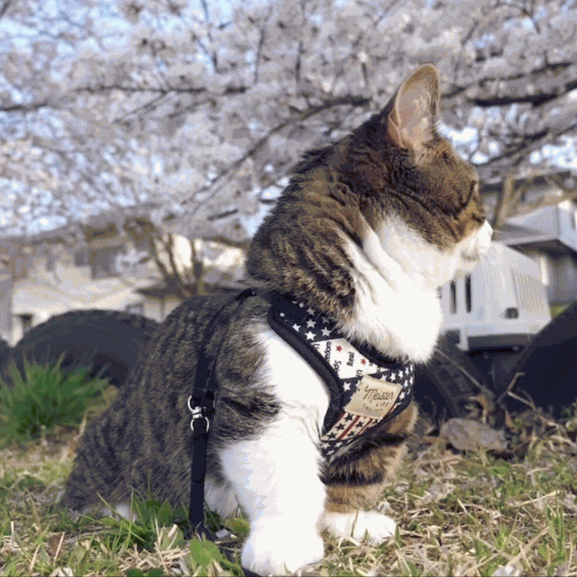
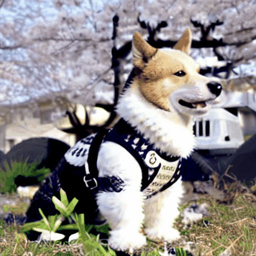
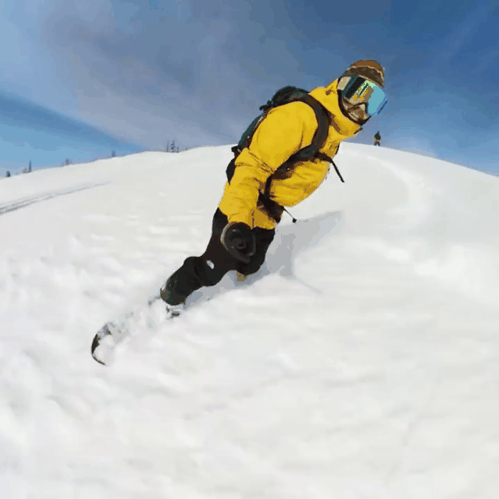
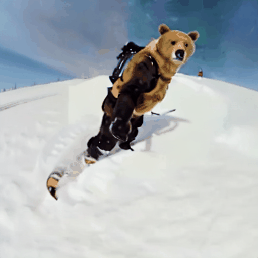
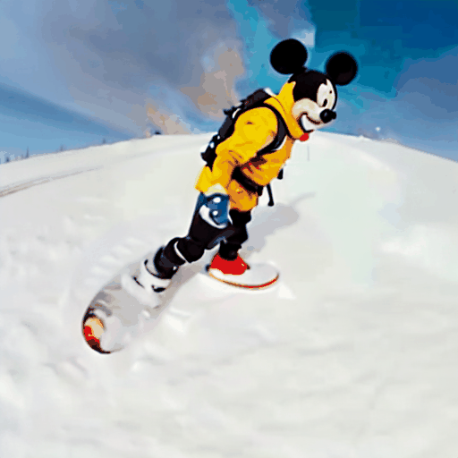

# SAVE: Protagonist Diversification with <U>S</U>tructure <U>A</U>gnostic <U>V</U>ideo <U>E</U>diting

This repository contains the official implementation of 
[<U>SAVE: Protagonist Diversification with Structure Agnostic Video Editing</U>](https://arxiv.org/abs/2312.02503).

[](https://ldynx.github.io/SAVE/)
[](https://arxiv.org/abs/2312.02503)


## Teaser
<h4 align="center"> 🐱 A cat is roaring ➜ 🐶 A dog is < S<sub>mot</sub> > / 🐯 A tiger is < S<sub>mot</sub> > </h4>

<p align="center">

</p>

<h4 align="center"> 😎 A man is skiing ➜ 🐻 A bear is < S<sub>mot</sub> > / 🐭 Mickey-Mouse is < S<sub>mot</sub> > </h4>

<p align="center">

</p>

<p align="center">
<em>SAVE reframes the video editing task as a motion inversion problem, seeking to find the motion word < S<sub>mot</sub> > in textual embedding space to well represent the motion in a source video. The video editing task can be achieved by isolating the motion from a single source video with < S<sub>mot</sub> > and then modifying the protagonist accordingly.</em>
</p>

## Citation

```
@article{song2023save,
      title={SAVE: Protagonist Diversification with Structure Agnostic Video Editing}, 
      author={Yeji Song and Wonsik Shin and Junsoo Lee and Jeesoo Kim and Nojun Kwak},
      year={2023},
      eprint={2312.02503},
      archivePrefix={arXiv},
      primaryClass={cs.CV}
}
```
