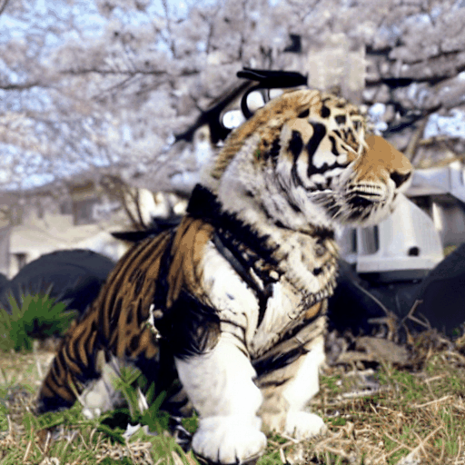

# SAVE: Protagonist Diversification with <U>S</U>tructure <U>A</U>gnostic <U>V</U>ideo <U>E</U>diting (ECCV 2024)

This repository contains the official implementation of 
[<U>SAVE: Protagonist Diversification with Structure Agnostic Video Editing</U>](https://arxiv.org/abs/2312.02503).

[](https://ldynx.github.io/SAVE/)
[](https://arxiv.org/abs/2312.02503)


## Teaser
<h4 align="center"> 🐱 A cat is roaring ➜ 🐶 A dog is < S<sub>mot</sub> > / 🐯 A tiger is < S<sub>mot</sub> > </h4>

<p align="center">

</p>

<h4 align="center"> 😎 A man is skiing ➜ 🐻 A bear is < S<sub>mot</sub> > / 🐭 Mickey-Mouse is < S<sub>mot</sub> > </h4>

<p align="center">

</p>

<p align="center">
<em>SAVE reframes the video editing task as a motion inversion problem, seeking to find the motion word < S<sub>mot</sub> > in textual embedding space to well represent the motion in a source video. The video editing task can be achieved by isolating the motion from a single source video with < S<sub>mot</sub> > and then modifying the protagonist accordingly.</em>
</p>

## Setup
### Requirements
```
pip install -r requirements.txt
```

### Weights
We use [Stable Diffusion v1-4](https://huggingface.co/CompVis/stable-diffusion-v1-4) as our base text-to-image model and fine-tune it on a reference video for text-to-video generation. Example video weights are available at [GoogleDrive](https://drive.google.com/drive/folders/1ytqzQ7aKBiiSQxDSbDPn2i-6zwdbUFsw).

### Training
To fine-tune the text-to-image diffusion models on a custom video, run this command:
```
python run_train.py --config configs/<video-name>-train.yaml
```
Configuration file `<video-name>-train.yaml` contains the following arguments:
* `output_dir` - Directory to save the weights.
* `placeholder_tokens` - Pseudo words separated by `|` e.g., `<s1>|<s2>`.
* `initializer_tokens` - Initialization words separated by `|` e.g., `cat|roaring`.
* `sentence_component` - Use `<o>` for appearance words and `<v>` for motion words e.g., `<o>|<v>`.
* `num_s1_train_epochs` - Number of epochs for appearance pre-registration.
* `exp_localization_weight` - Weight for the cross-attention loss (recommended range is 1e-4 to 5e-4).
* `train_data: video_path` - Path to the source video.
* `train_data: prompt` - Source prompt that includes the pseudo words in `placeholder_tokens` e.g., `a <s1> cat is <s2>`.
* `n_sample_frames` - Number of frames.


## Video Editing
Once the updated weights are prepared, run this command: 
```
python run_inference.py --config configs/<video-name>-inference.yaml
```
Configuration file `<video-name>-inference.yaml` contains the following arguments:
* `pretrained_model_path` - Directory to the saved weights.
* `image_path` - Path to the source video.
* `placeholder_tokens` - Pseudo words separated by `|` e.g., `<s1>|<s2>`.
* `sentence_component` - Use `<o>` for appearance words and `<v>` for motion words e.g., `<o>|<v>`.
* `prompt` - Source prompt that includes the pseudo words in `placeholder_tokens` e.g., `a <s1> cat is <s2>`.
* `prompts` - List of source and editing prompts e.g., [`a <s1> cat is <s2>`, `a dog is <s2>`].
* `blend_word` - List of protagonists in the source and edited videos e.g., [`cat`, `dog`].


## Citation

```
@inproceedings{song2025save,
  title={Save: Protagonist diversification with structure agnostic video editing},
  author={Song, Yeji and Shin, Wonsik and Lee, Junsoo and Kim, Jeesoo and Kwak, Nojun},
  booktitle={European Conference on Computer Vision},
  pages={41--57},
  year={2025},
  organization={Springer}
}
```

## Acknowledgements
This code builds upon [diffusers](https://github.com/huggingface/diffusers), [Tune-A-Video](https://github.com/showlab/Tune-A-Video) and [Video-P2P](https://github.com/dvlab-research/Video-P2P). Thank you for open-sourcing!

